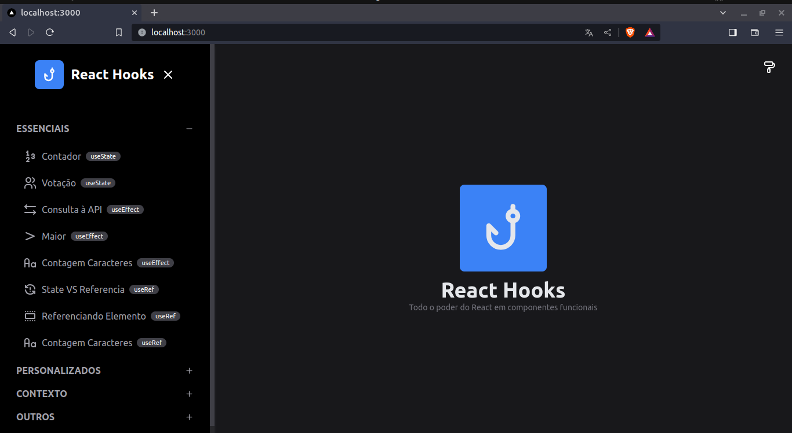
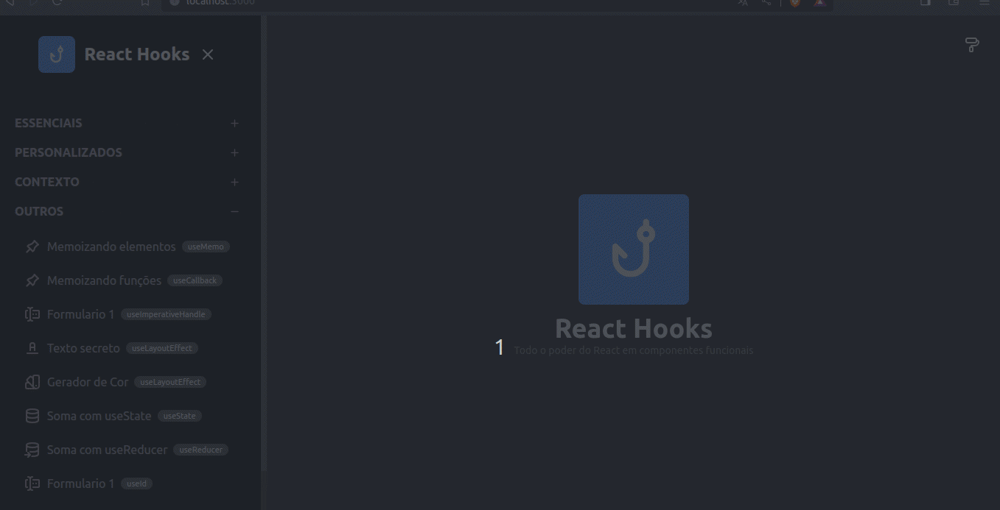

# Menu da Aplicação

<p align="center">
</img>
</img>
</p>

# Curso de React Hooks
O curso de React Hooks faz parte da Trilha React & Next do **Especialista.dev** do Curso de **Escola de Foramação DEV**.

Aqui aprendemos como utilizar os Hooks, uma funcionalidade do React que adiciona uma série de funcionalidades aos componentes funcionais.

Neste curso conhecemos desde os conceitos básicos dos Hooks e como utilizar os hooks mais populares do React na criação de componentes funcionais. Além de aprender a  utilizar hooks relacionados a estado, efeitos colaterais, contexto, referência, memoização e muito mais, também aprendemos a criar nossos próprios hooks. 

Para visualização dos Hooks foi usado uma página onde os principais Hooks foram abordados em aula e transformados em exemplos você pode ver cada um deles no menu lateral da página clicando no símbolo "+" para abrir e navegar entre os diversos exemplos.

Os Hooks permitem que você adicione funcionalidades que antes só estavam disponíveis para componentes de classe, como o gerenciamento de estados, efeitos colaterais, contextos e muito mais. Eles também permitem que você crie componentes mais reutilizáveis e mais fáceis de testar.

## O que você vai encontrar neste repositório
* Como utilizar hooks
* **Hooks básicos** - Utilização de hooks básicos como `useState`, `useEffect` e `useRef`
* **Hooks personalizados** - Como criar hooks personalizados
* **Aplicando Hooks** - Aplicação dos hooks vistos até o momento na interface da aplicação
* **Contexto** - Como utilizar o hook `useContext`
* **Aplicando Contexto** - Aplicação do hook `useContext` na interface
* **Outros hooks** - Outros hooks do React

# 🤔 Segue abaixo como o projeto foi criado caso queira baixar e rodar no seu PC 
This is a [Next.js](https://nextjs.org/) project bootstrapped with [`create-next-app`](https://github.com/vercel/next.js/tree/canary/packages/create-next-app).

## Getting Started

First, run the development server:

```bash
npm run dev
# or
yarn dev
# or
pnpm dev
```

Open [http://localhost:3000](http://localhost:3000) with your browser to see the result.

You can start editing the page by modifying `pages/index.tsx`. The page auto-updates as you edit the file.

[API routes](https://nextjs.org/docs/api-routes/introduction) can be accessed on [http://localhost:3000/api/hello](http://localhost:3000/api/hello). This endpoint can be edited in `pages/api/hello.ts`.

The `pages/api` directory is mapped to `/api/*`. Files in this directory are treated as [API routes](https://nextjs.org/docs/api-routes/introduction) instead of React pages.

This project uses [`next/font`](https://nextjs.org/docs/basic-features/font-optimization) to automatically optimize and load Inter, a custom Google Font.

## Learn More

To learn more about Next.js, take a look at the following resources:

- [Next.js Documentation](https://nextjs.org/docs) - learn about Next.js features and API.
- [Learn Next.js](https://nextjs.org/learn) - an interactive Next.js tutorial.

You can check out [the Next.js GitHub repository](https://github.com/vercel/next.js/) - your feedback and contributions are welcome!

## Deploy on Vercel

The easiest way to deploy your Next.js app is to use the [Vercel Platform](https://vercel.com/new?utm_medium=default-template&filter=next.js&utm_source=create-next-app&utm_campaign=create-next-app-readme) from the creators of Next.js.

Check out our [Next.js deployment documentation](https://nextjs.org/docs/deployment) for more details.
